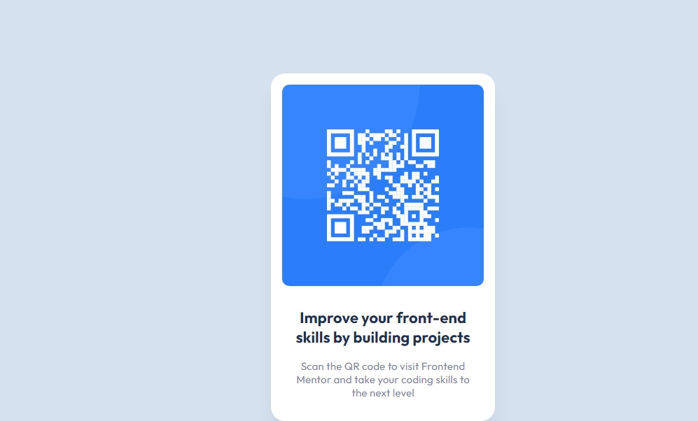

# qr-code
 
 this is one of the frontend mentor challenge which is a newbie level one,it can be created using html and css 
 i uploaded my solution you can check it out and i also submited the solution in frontend mentor you can check that also

 here is the screenshot of my output:

